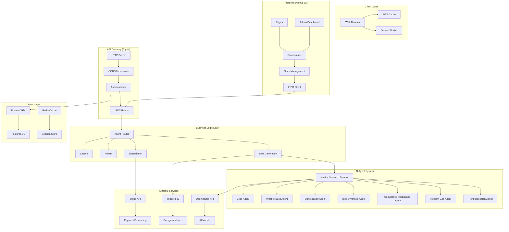
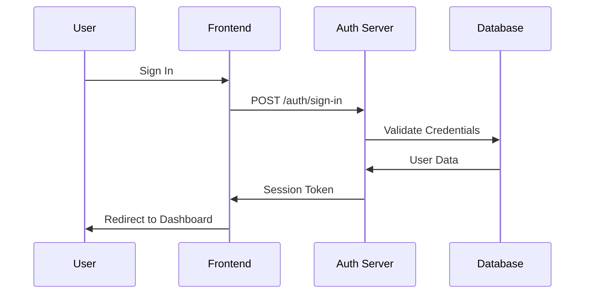
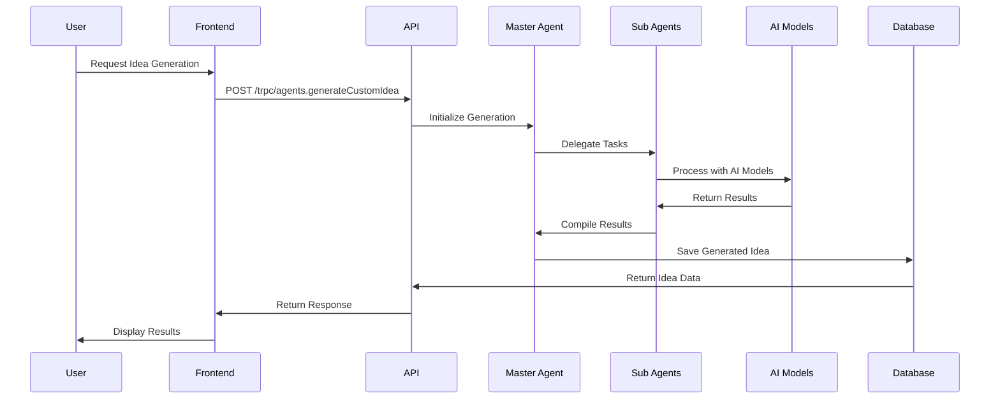
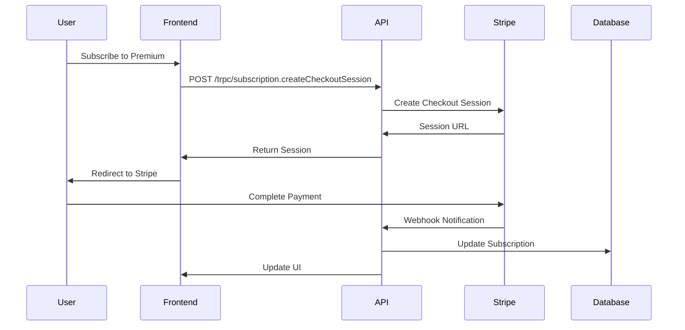
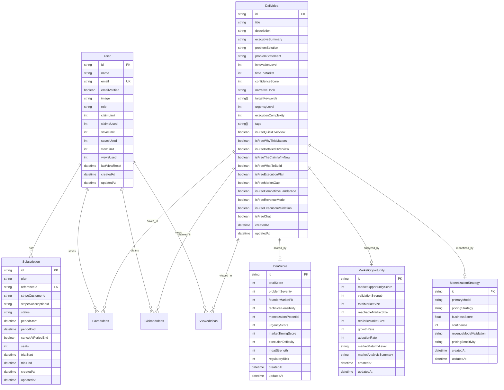
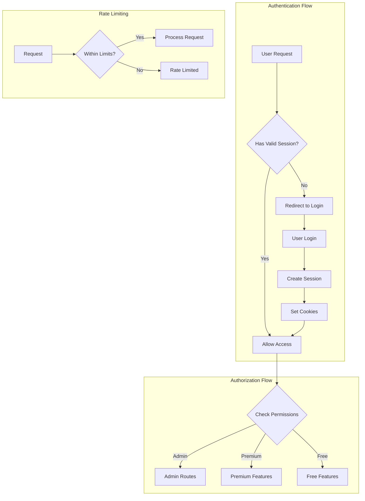
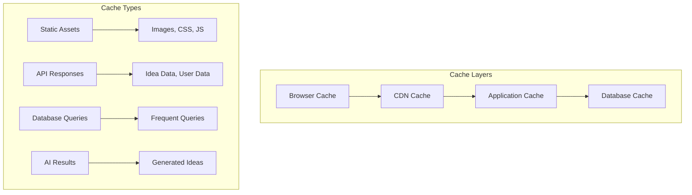
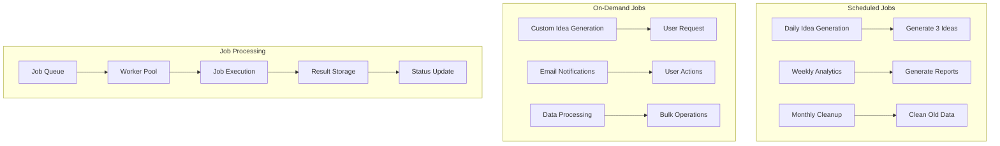
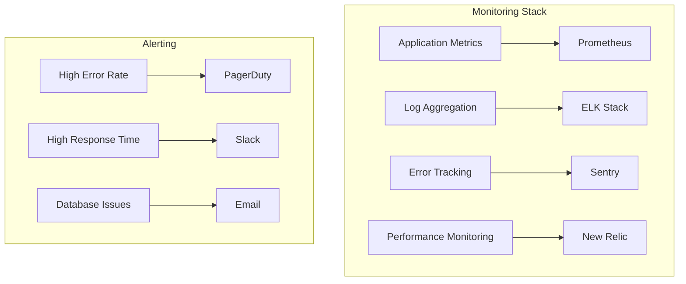

# System Architecture Overview

Nugget Finder is built as a modern full-stack application with a clear separation between frontend, backend, and external services. The system is designed for scalability, maintainability, and optimal performance.

## 🏗️ Architecture Principles

The Nugget Finder platform is built on modern, scalable architecture principles:

- **Type Safety**: End-to-end TypeScript with tRPC for type-safe APIs
- **Modularity**: Monorepo structure with clear separation of concerns
- **Scalability**: Microservices-ready architecture with background job processing
- **Security**: Role-based access control and secure authentication
- **Performance**: Optimized database queries and caching strategies

## 📊 System Architecture Diagram



## 🔄 Data Flow Architecture

### 1. User Authentication Flow



### 2. Idea Generation Flow



### 3. Subscription Management Flow



## 🗄️ Database Architecture

### Entity Relationship Diagram



### Database Indexing Strategy

```sql
-- Performance indexes for common queries
CREATE INDEX idx_daily_idea_created_at ON "DailyIdea"("createdAt" DESC);
CREATE INDEX idx_daily_idea_confidence_score ON "DailyIdea"("confidenceScore" DESC);
CREATE INDEX idx_daily_idea_tags ON "DailyIdea" USING GIN("tags");
CREATE INDEX idx_user_email ON "User"("email");
CREATE INDEX idx_subscription_status ON "Subscription"("status");
CREATE INDEX idx_saved_ideas_user_idea ON "SavedIdeas"("userId", "ideaId");
CREATE INDEX idx_claimed_ideas_user ON "ClaimedIdeas"("userId");
```

## 🤖 AI Agent Architecture

### Multi-Agent System Design

The platform uses a sophisticated multi-agent system with specialized roles:

```mermaid
graph TB
    subgraph "Orchestration Layer"
        A[Master Research Director] --> B[Agent Coordinator]
        B --> C[Progress Tracker]
        B --> D[Quality Controller]
    end
    
    subgraph "Research Agents"
        E[Trend Research Agent] --> F[Market Trends]
        E --> G[Technology Trends]
        E --> H[Social Trends]
    end
    
    subgraph "Analysis Agents"
        I[Problem Gap Agent] --> J[Problem Identification]
        I --> K[Market Gaps]
        I --> L[Opportunity Analysis]
    end
    
    subgraph "Intelligence Agents"
        M[Competitive Intelligence Agent] --> N[Competitor Analysis]
        M --> O[Market Positioning]
        M --> P[Competitive Advantages]
    end
    
    subgraph "Synthesis Agents"
        Q[Idea Synthesis Agent] --> R[Idea Generation]
        Q --> S[Concept Validation]
        Q --> T[Market Fit Analysis]
    end
    
    subgraph "Business Agents"
        U[Monetization Agent] --> V[Revenue Models]
        U --> W[Pricing Strategies]
        U --> X[Financial Projections]
    end
    
    subgraph "Technical Agents"
        Y[What to Build Agent] --> Z[Technical Architecture]
        Y --> AA[Implementation Plan]
        Y --> BB[Technology Stack]
    end
    
    subgraph "Evaluation Agents"
        CC[Critic Agent] --> DD[Idea Scoring]
        CC --> EE[Risk Assessment]
        CC --> FF[Feasibility Analysis]
    end
    
    A --> E
    A --> I
    A --> M
    A --> Q
    A --> U
    A --> Y
    A --> CC
```



### Agent Communication Protocol

```typescript
interface AgentMessage {
  from: string;
  to: string;
  type: 'request' | 'response' | 'error';
  data: any;
  timestamp: Date;
  correlationId: string;
}

interface AgentContext {
  sessionId: string;
  userId?: string;
  requestId: string;
  progress: number;
  status: 'pending' | 'running' | 'completed' | 'failed';
  results: Record<string, any>;
}
```

## 🔐 Security Architecture

### Authentication & Authorization



### Security Measures

1. **Authentication**
   - Better Auth with secure session management
   - JWT tokens with short expiration
   - CSRF protection
   - Secure cookie settings

2. **Authorization**
   - Role-based access control (RBAC)
   - Resource-level permissions
   - API rate limiting
   - Input validation and sanitization

3. **Data Protection**
   - Database encryption at rest
   - HTTPS/TLS for all communications
   - Secure API key management
   - Regular security audits

## 📈 Performance Architecture

### Caching Strategy



### Performance Optimizations

1. **Frontend Optimizations**
   - Code splitting and lazy loading
   - Image optimization and WebP format
   - Service worker for offline functionality
   - React.memo for component optimization

2. **Backend Optimizations**
   - Database query optimization
   - Connection pooling
   - Background job processing
   - API response caching

3. **Database Optimizations**
   - Strategic indexing
   - Query optimization
   - Read replicas for scaling
   - Connection pooling

## 🔄 Background Job Architecture

### Trigger.dev Integration



### Job Types and Scheduling

```typescript
interface JobDefinition {
  name: string;
  schedule?: string; // Cron expression
  handler: (payload: any) => Promise<void>;
  retries: number;
  timeout: number;
  concurrency: number;
}

const jobs: JobDefinition[] = [
  {
    name: 'daily-idea-generation',
    schedule: '0 6 * * *', // Daily at 6 AM
    handler: generateDailyIdeas,
    retries: 3,
    timeout: 3600,
    concurrency: 1
  },
  {
    name: 'on-demand-idea-generation',
    handler: generateCustomIdea,
    retries: 2,
    timeout: 1800,
    concurrency: 5
  }
];
```

## 🚀 Scalability Considerations

### Horizontal Scaling

1. **Application Scaling**
   - Stateless API design
   - Load balancer configuration
   - Auto-scaling groups
   - Container orchestration (Docker/Kubernetes)

2. **Database Scaling**
   - Read replicas for read-heavy workloads
   - Connection pooling
   - Query optimization
   - Database sharding (future)

3. **AI Service Scaling**
   - Model caching
   - Request batching
   - Fallback models
   - Cost optimization

### Monitoring and Observability



This architecture provides a solid foundation for the Nugget Finder platform, ensuring scalability, security, and maintainability as the application grows.


