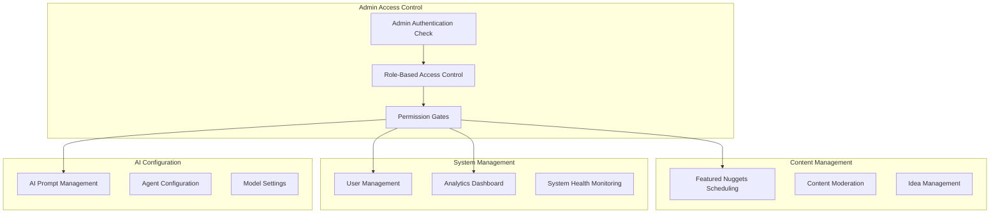

# Admin Dashboard

The Admin Dashboard provides comprehensive management tools for administrators to oversee the Nugget Finder platform, manage featured content, monitor system performance, and configure AI agents.

## Overview

The admin dashboard offers:
- Featured nuggets scheduling and management
- AI agent prompt customization
- User management and analytics
- System monitoring and health checks
- Content moderation tools
- Subscription and revenue analytics

## Admin Architecture



## Access Control

### Role-Based Authorization

```typescript
// Admin role check middleware
export function requireAdmin(
  req: Request,
  res: Response,
  next: NextFunction
) {
  const user = req.user;
  
  if (!user || user.role !== 'ADMIN') {
    return res.status(403).json({ 
      error: 'Admin access required' 
    });
  }
  
  next();
}

// tRPC procedure with admin check
export const adminProcedure = protectedProcedure
  .use(({ ctx, next }) => {
    if (ctx.user.role !== 'ADMIN') {
      throw new TRPCError({
        code: 'FORBIDDEN',
        message: 'Admin access required',
      });
    }
    
    return next({ ctx });
  });
```

### Admin UI Protection

```typescript
// apps/web/src/components/admin/AdminRoute.tsx
import { useAuth } from '@/hooks/useAuth';
import { useRouter } from 'next/navigation';
import { useEffect } from 'react';

interface AdminRouteProps {
  children: React.ReactNode;
}

export function AdminRoute({ children }: AdminRouteProps) {
  const { user, isLoading } = useAuth();
  const router = useRouter();

  useEffect(() => {
    if (!isLoading && (!user || user.role !== 'ADMIN')) {
      router.push('/dashboard');
    }
  }, [user, isLoading, router]);

  if (isLoading) {
    return <div>Loading...</div>;
  }

  if (!user || user.role !== 'ADMIN') {
    return null;
  }

  return <>{children}</>;
}
```

## Featured Nuggets Management

### Scheduling System

**Database Schema**:
```prisma
model FeaturedNuggetsSchedule {
  id        String   @id @default(cuid())
  date      DateTime @unique
  ideaIds   String[] // Array of DailyIdea IDs
  order     Int      @default(0)
  isActive  Boolean  @default(true)
  createdBy String   // Admin user ID
  
  creator User @relation(fields: [createdBy], references: [id])
  
  createdAt DateTime @default(now())
  updatedAt DateTime @updatedAt

  @@map("featured_nuggets_schedules")
}
```

**Featured Nuggets Service**:
```typescript
// apps/server/src/lib/admin/featured-nuggets.ts
export class FeaturedNuggetsService {
  async scheduleFeaturedNuggets(
    date: Date,
    ideaIds: string[],
    adminId: string
  ): Promise<FeaturedNuggetsSchedule> {
    // Validate that all idea IDs exist
    const validIdeas = await prisma.dailyIdea.findMany({
      where: { id: { in: ideaIds } },
      select: { id: true },
    });

    if (validIdeas.length !== ideaIds.length) {
      throw new Error('Some idea IDs are invalid');
    }

    return prisma.featuredNuggetsSchedule.upsert({
      where: { date },
      create: {
        date,
        ideaIds,
        createdBy: adminId,
        isActive: true,
      },
      update: {
        ideaIds,
        createdBy: adminId,
        updatedAt: new Date(),
      },
    });
  }

  async getFeaturedNuggets(date: Date): Promise<DailyIdea[]> {
    const schedule = await prisma.featuredNuggetsSchedule.findUnique({
      where: { date, isActive: true },
    });

    if (!schedule) {
      return [];
    }

    return prisma.dailyIdea.findMany({
      where: { id: { in: schedule.ideaIds } },
      include: {
        score: true,
        marketOpportunity: true,
        monetizationStrategy: true,
      },
      orderBy: {
        confidenceScore: 'desc',
      },
    });
  }

  async getTodaysFeaturedNuggets(): Promise<DailyIdea[]> {
    const today = new Date();
    today.setHours(0, 0, 0, 0);
    return this.getFeaturedNuggets(today);
  }

  async getScheduleCalendar(
    startDate: Date,
    endDate: Date
  ): Promise<FeaturedNuggetsSchedule[]> {
    return prisma.featuredNuggetsSchedule.findMany({
      where: {
        date: {
          gte: startDate,
          lte: endDate,
        },
      },
      include: {
        creator: {
          select: { name: true, email: true },
        },
      },
      orderBy: { date: 'asc' },
    });
  }
}
```

### Featured Nuggets UI

```typescript
// apps/web/src/components/admin/FeaturedNuggetsManager.tsx
import { useState } from 'react';
import { trpc } from '@/lib/trpc';
import { Calendar } from '@/components/ui/calendar';
import { Button } from '@/components/ui/button';
import { IdeaCard } from '@/components/IdeaCard';

export function FeaturedNuggetsManager() {
  const [selectedDate, setSelectedDate] = useState<Date>(new Date());
  const [selectedIdeas, setSelectedIdeas] = useState<string[]>([]);

  const { data: availableIdeas } = trpc.admin.getAvailableIdeas.useQuery();
  const { data: schedule } = trpc.admin.getFeaturedSchedule.useQuery({
    date: selectedDate,
  });

  const scheduleMutation = trpc.admin.scheduleFeaturedNuggets.useMutation({
    onSuccess: () => {
      // Refresh data
    },
  });

  const handleSchedule = () => {
    scheduleMutation.mutate({
      date: selectedDate,
      ideaIds: selectedIdeas,
    });
  };

  return (
    <div className="space-y-6">
      <div className="flex gap-6">
        {/* Calendar */}
        <div className="w-1/3">
          <h3 className="text-lg font-semibold mb-4">Select Date</h3>
          <Calendar
            mode="single"
            selected={selectedDate}
            onSelect={setSelectedDate}
            className="rounded-md border"
          />
        </div>

        {/* Available Ideas */}
        <div className="w-2/3">
          <h3 className="text-lg font-semibold mb-4">
            Available Ideas for {selectedDate.toDateString()}
          </h3>
          
          <div className="grid grid-cols-1 md:grid-cols-2 gap-4 max-h-96 overflow-y-auto">
            {availableIdeas?.map((idea) => (
              <div
                key={idea.id}
                className={`cursor-pointer border rounded-lg p-4 ${
                  selectedIdeas.includes(idea.id)
                    ? 'border-blue-500 bg-blue-50'
                    : 'border-gray-200'
                }`}
                onClick={() => {
                  setSelectedIdeas(prev =>
                    prev.includes(idea.id)
                      ? prev.filter(id => id !== idea.id)
                      : [...prev, idea.id]
                  );
                }}
              >
                <IdeaCard idea={idea} compact />
              </div>
            ))}
          </div>

          <div className="mt-4 flex justify-between items-center">
            <span className="text-sm text-gray-600">
              {selectedIdeas.length} ideas selected
            </span>
            <Button
              onClick={handleSchedule}
              disabled={selectedIdeas.length === 0 || scheduleMutation.isLoading}
            >
              Schedule Featured Nuggets
            </Button>
          </div>
        </div>
      </div>

      {/* Current Schedule Preview */}
      {schedule && (
        <div className="border-t pt-6">
          <h3 className="text-lg font-semibold mb-4">
            Currently Scheduled for {selectedDate.toDateString()}
          </h3>
          <div className="grid grid-cols-1 md:grid-cols-3 gap-4">
            {schedule.ideas?.map((idea) => (
              <IdeaCard key={idea.id} idea={idea} />
            ))}
          </div>
        </div>
      )}
    </div>
  );
}
```

## AI Prompt Management

### Dynamic Prompt System

**Database Schema**:
```prisma
model AdminPrompts {
  id            String  @id @default(cuid())
  agentName     String  // "TrendResearchAgent", "IdeaSynthesisAgent", etc.
  promptKey     String  // "main_prompt", "follow_up_prompt"
  promptContent String  @db.Text
  isActive      Boolean @default(true)
  updatedBy     String  // Admin user ID
  
  updater User @relation(fields: [updatedBy], references: [id])
  
  createdAt DateTime @default(now())
  updatedAt DateTime @updatedAt

  @@unique([agentName, promptKey])
  @@map("admin_prompts")
}
```

**Prompt Management Service**:
```typescript
// apps/server/src/lib/admin/prompt-management.ts
export class PromptManagementService {
  async updatePrompt(
    agentName: string,
    promptKey: string,
    promptContent: string,
    adminId: string
  ): Promise<AdminPrompts> {
    return prisma.adminPrompts.upsert({
      where: {
        agentName_promptKey: {
          agentName,
          promptKey,
        },
      },
      create: {
        agentName,
        promptKey,
        promptContent,
        updatedBy: adminId,
        isActive: true,
      },
      update: {
        promptContent,
        updatedBy: adminId,
        updatedAt: new Date(),
      },
    });
  }

  async getPrompt(agentName: string, promptKey: string): Promise<string> {
    const customPrompt = await prisma.adminPrompts.findUnique({
      where: {
        agentName_promptKey: {
          agentName,
          promptKey,
        },
        isActive: true,
      },
    });

    return customPrompt?.promptContent || this.getDefaultPrompt(agentName, promptKey);
  }

  async getAllPrompts(): Promise<AdminPrompts[]> {
    return prisma.adminPrompts.findMany({
      where: { isActive: true },
      include: {
        updater: {
          select: { name: true, email: true },
        },
      },
      orderBy: [
        { agentName: 'asc' },
        { promptKey: 'asc' },
      ],
    });
  }

  private getDefaultPrompt(agentName: string, promptKey: string): string {
    const defaultPrompts = {
      TrendResearchAgent: {
        main_prompt: `You are a market research expert specializing in identifying emerging trends...`,
        follow_up_prompt: `Based on the trends identified, provide additional analysis...`,
      },
      IdeaSynthesisAgent: {
        main_prompt: `You are the Trend Architect - a world-class startup idea synthesizer...`,
      },
      // Add other agents...
    };

    return defaultPrompts[agentName]?.[promptKey] || 'Default prompt not found';
  }

  async resetToDefault(
    agentName: string,
    promptKey: string,
    adminId: string
  ): Promise<void> {
    await prisma.adminPrompts.updateMany({
      where: { agentName, promptKey },
      data: { isActive: false, updatedBy: adminId },
    });
  }
}
```

### Prompt Management UI

```typescript
// apps/web/src/components/admin/PromptManager.tsx
import { useState } from 'react';
import { trpc } from '@/lib/trpc';
import { Button } from '@/components/ui/button';
import { Textarea } from '@/components/ui/textarea';
import { Select } from '@/components/ui/select';
import { Card } from '@/components/ui/card';

const AGENTS = [
  'TrendResearchAgent',
  'ProblemGapAgent',
  'CompetitiveIntelligenceAgent',
  'IdeaSynthesisAgent',
  'MonetizationAgent',
  'WhatToBuildAgent',
  'CriticAgent',
];

const PROMPT_KEYS = [
  'main_prompt',
  'follow_up_prompt',
  'validation_prompt',
];

export function PromptManager() {
  const [selectedAgent, setSelectedAgent] = useState(AGENTS[0]);
  const [selectedPromptKey, setSelectedPromptKey] = useState(PROMPT_KEYS[0]);
  const [promptContent, setPromptContent] = useState('');

  const { data: prompts, refetch } = trpc.admin.getAllPrompts.useQuery();
  const updatePromptMutation = trpc.admin.updatePrompt.useMutation({
    onSuccess: () => refetch(),
  });

  const resetPromptMutation = trpc.admin.resetPrompt.useMutation({
    onSuccess: () => {
      refetch();
      setPromptContent('');
    },
  });

  const currentPrompt = prompts?.find(
    p => p.agentName === selectedAgent && p.promptKey === selectedPromptKey
  );

  const handleSave = () => {
    updatePromptMutation.mutate({
      agentName: selectedAgent,
      promptKey: selectedPromptKey,
      promptContent,
    });
  };

  const handleReset = () => {
    resetPromptMutation.mutate({
      agentName: selectedAgent,
      promptKey: selectedPromptKey,
    });
  };

  return (
    <div className="space-y-6">
      <div className="flex gap-4">
        <div className="flex-1">
          <label className="block text-sm font-medium mb-2">Agent</label>
          <Select
            value={selectedAgent}
            onValueChange={setSelectedAgent}
          >
            {AGENTS.map(agent => (
              <option key={agent} value={agent}>
                {agent}
              </option>
            ))}
          </Select>
        </div>

        <div className="flex-1">
          <label className="block text-sm font-medium mb-2">Prompt Type</label>
          <Select
            value={selectedPromptKey}
            onValueChange={setSelectedPromptKey}
          >
            {PROMPT_KEYS.map(key => (
              <option key={key} value={key}>
                {key.replace('_', ' ').toUpperCase()}
              </option>
            ))}
          </Select>
        </div>
      </div>

      <Card className="p-4">
        <div className="space-y-4">
          <div className="flex justify-between items-center">
            <h3 className="text-lg font-semibold">
              {selectedAgent} - {selectedPromptKey}
            </h3>
            {currentPrompt && (
              <div className="text-sm text-gray-600">
                Last updated: {new Date(currentPrompt.updatedAt).toLocaleString()}
                {currentPrompt.updater && ` by ${currentPrompt.updater.name}`}
              </div>
            )}
          </div>

          <Textarea
            value={promptContent || currentPrompt?.promptContent || ''}
            onChange={(e) => setPromptContent(e.target.value)}
            rows={12}
            className="font-mono text-sm"
            placeholder="Enter prompt content..."
          />

          <div className="flex gap-2">
            <Button
              onClick={handleSave}
              disabled={updatePromptMutation.isLoading}
            >
              Save Prompt
            </Button>
            <Button
              variant="outline"
              onClick={handleReset}
              disabled={resetPromptMutation.isLoading}
            >
              Reset to Default
            </Button>
          </div>
        </div>
      </Card>

      {/* Prompt History */}
      <Card className="p-4">
        <h3 className="text-lg font-semibold mb-4">All Custom Prompts</h3>
        <div className="space-y-2">
          {prompts?.map((prompt) => (
            <div
              key={`${prompt.agentName}-${prompt.promptKey}`}
              className="flex justify-between items-center p-2 border rounded"
            >
              <div>
                <span className="font-medium">{prompt.agentName}</span>
                <span className="mx-2">-</span>
                <span className="text-gray-600">{prompt.promptKey}</span>
              </div>
              <div className="text-sm text-gray-500">
                Updated {new Date(prompt.updatedAt).toLocaleDateString()}
              </div>
            </div>
          ))}
        </div>
      </Card>
    </div>
  );
}
```

## User Management

### User Analytics Dashboard

```typescript
// apps/web/src/components/admin/UserManagement.tsx
import { trpc } from '@/lib/trpc';
import { Card } from '@/components/ui/card';
import { Badge } from '@/components/ui/badge';

export function UserManagement() {
  const { data: userStats } = trpc.admin.getUserStats.useQuery();
  const { data: recentUsers } = trpc.admin.getRecentUsers.useQuery();

  return (
    <div className="space-y-6">
      {/* User Statistics */}
      <div className="grid grid-cols-1 md:grid-cols-4 gap-4">
        <Card className="p-4">
          <div className="text-2xl font-bold">{userStats?.totalUsers}</div>
          <div className="text-sm text-gray-600">Total Users</div>
        </Card>
        <Card className="p-4">
          <div className="text-2xl font-bold">{userStats?.activeUsers}</div>
          <div className="text-sm text-gray-600">Active Users (30 days)</div>
        </Card>
        <Card className="p-4">
          <div className="text-2xl font-bold">{userStats?.paidUsers}</div>
          <div className="text-sm text-gray-600">Paid Subscribers</div>
        </Card>
        <Card className="p-4">
          <div className="text-2xl font-bold">
            {userStats?.conversionRate?.toFixed(1)}%
          </div>
          <div className="text-sm text-gray-600">Conversion Rate</div>
        </Card>
      </div>

      {/* Recent Users */}
      <Card className="p-4">
        <h3 className="text-lg font-semibold mb-4">Recent Users</h3>
        <div className="space-y-2">
          {recentUsers?.map((user) => (
            <div
              key={user.id}
              className="flex justify-between items-center p-2 border rounded"
            >
              <div>
                <div className="font-medium">{user.name || user.email}</div>
                <div className="text-sm text-gray-600">{user.email}</div>
              </div>
              <div className="flex items-center gap-2">
                <Badge variant={user.role === 'ADMIN' ? 'destructive' : 'default'}>
                  {user.role}
                </Badge>
                {user.subscription && (
                  <Badge variant="outline">
                    {user.subscription.plan}
                  </Badge>
                )}
                <div className="text-sm text-gray-500">
                  {new Date(user.createdAt).toLocaleDateString()}
                </div>
              </div>
            </div>
          ))}
        </div>
      </Card>
    </div>
  );
}
```

## System Analytics

### Revenue and Usage Analytics

```typescript
// apps/server/src/lib/admin/analytics.ts
export class AdminAnalyticsService {
  async getRevenueDashboard(): Promise<RevenueDashboard> {
    const [
      totalRevenue,
      monthlyRevenue,
      activeSubscriptions,
      churnRate,
    ] = await Promise.all([
      this.getTotalRevenue(),
      this.getMonthlyRevenue(),
      this.getActiveSubscriptions(),
      this.getChurnRate(),
    ]);

    return {
      totalRevenue,
      monthlyRevenue,
      activeSubscriptions,
      churnRate,
    };
  }

  async getUserEngagementMetrics(): Promise<EngagementMetrics> {
    const [
      dailyActiveUsers,
      monthlyActiveUsers,
      averageSessionDuration,
      topFeatures,
    ] = await Promise.all([
      this.getDailyActiveUsers(),
      this.getMonthlyActiveUsers(),
      this.getAverageSessionDuration(),
      this.getTopFeatures(),
    ]);

    return {
      dailyActiveUsers,
      monthlyActiveUsers,
      averageSessionDuration,
      topFeatures,
    };
  }

  async getSystemHealth(): Promise<SystemHealthMetrics> {
    const [
      apiResponseTimes,
      errorRates,
      databasePerformance,
      agentPerformance,
    ] = await Promise.all([
      this.getApiResponseTimes(),
      this.getErrorRates(),
      this.getDatabasePerformance(),
      this.getAgentPerformance(),
    ]);

    return {
      apiResponseTimes,
      errorRates,
      databasePerformance,
      agentPerformance,
    };
  }

  private async getTotalRevenue(): Promise<number> {
    const subscriptions = await prisma.subscription.findMany({
      where: { status: 'active' },
    });

    return subscriptions.reduce((total, sub) => {
      const monthlyRevenue = PLAN_PRICING[sub.plan] || 0;
      return total + monthlyRevenue;
    }, 0);
  }

  private async getMonthlyRevenue(): Promise<number[]> {
    const last12Months = [];
    const now = new Date();

    for (let i = 11; i >= 0; i--) {
      const monthStart = new Date(now.getFullYear(), now.getMonth() - i, 1);
      const monthEnd = new Date(now.getFullYear(), now.getMonth() - i + 1, 0);

      const subscriptions = await prisma.subscription.count({
        where: {
          status: 'active',
          createdAt: {
            gte: monthStart,
            lte: monthEnd,
          },
        },
      });

      last12Months.push(subscriptions);
    }

    return last12Months;
  }

  private async getAgentPerformance(): Promise<AgentPerformanceMetric[]> {
    // This would be implemented with actual agent performance tracking
    return [
      {
        agentName: 'TrendResearchAgent',
        averageExecutionTime: 2500,
        successRate: 98.5,
        errorRate: 1.5,
      },
      {
        agentName: 'IdeaSynthesisAgent',
        averageExecutionTime: 3200,
        successRate: 97.8,
        errorRate: 2.2,
      },
      // ... other agents
    ];
  }
}

const PLAN_PRICING = {
  FREE: 0,
  BASIC: 2900,
  PRO: 9900,
  ENTERPRISE: 29900,
};
```

## tRPC Admin Router

```typescript
// apps/server/src/routers/admin.ts
import { z } from 'zod';
import { router, adminProcedure } from '@/lib/trpc';
import { FeaturedNuggetsService } from '@/lib/admin/featured-nuggets';
import { PromptManagementService } from '@/lib/admin/prompt-management';
import { AdminAnalyticsService } from '@/lib/admin/analytics';

const featuredNuggetsService = new FeaturedNuggetsService();
const promptManagementService = new PromptManagementService();
const analyticsService = new AdminAnalyticsService();

export const adminRouter = router({
  // Featured Nuggets Management
  scheduleFeaturedNuggets: adminProcedure
    .input(z.object({
      date: z.date(),
      ideaIds: z.array(z.string()),
    }))
    .mutation(async ({ ctx, input }) => {
      return featuredNuggetsService.scheduleFeaturedNuggets(
        input.date,
        input.ideaIds,
        ctx.user.id
      );
    }),

  getFeaturedSchedule: adminProcedure
    .input(z.object({ date: z.date() }))
    .query(async ({ input }) => {
      return featuredNuggetsService.getFeaturedNuggets(input.date);
    }),

  getAvailableIdeas: adminProcedure
    .query(async () => {
      return prisma.dailyIdea.findMany({
        include: {
          score: true,
          marketOpportunity: true,
        },
        orderBy: { confidenceScore: 'desc' },
        take: 20,
      });
    }),

  // Prompt Management
  updatePrompt: adminProcedure
    .input(z.object({
      agentName: z.string(),
      promptKey: z.string(),
      promptContent: z.string(),
    }))
    .mutation(async ({ ctx, input }) => {
      return promptManagementService.updatePrompt(
        input.agentName,
        input.promptKey,
        input.promptContent,
        ctx.user.id
      );
    }),

  getAllPrompts: adminProcedure
    .query(async () => {
      return promptManagementService.getAllPrompts();
    }),

  resetPrompt: adminProcedure
    .input(z.object({
      agentName: z.string(),
      promptKey: z.string(),
    }))
    .mutation(async ({ ctx, input }) => {
      return promptManagementService.resetToDefault(
        input.agentName,
        input.promptKey,
        ctx.user.id
      );
    }),

  // Analytics
  getRevenueDashboard: adminProcedure
    .query(async () => {
      return analyticsService.getRevenueDashboard();
    }),

  getUserStats: adminProcedure
    .query(async () => {
      const [totalUsers, activeUsers, paidUsers] = await Promise.all([
        prisma.user.count(),
        prisma.user.count({
          where: {
            updatedAt: {
              gte: new Date(Date.now() - 30 * 24 * 60 * 60 * 1000), // 30 days
            },
          },
        }),
        prisma.subscription.count({
          where: { 
            status: 'active',
            plan: { not: 'FREE' },
          },
        }),
      ]);

      return {
        totalUsers,
        activeUsers,
        paidUsers,
        conversionRate: totalUsers > 0 ? (paidUsers / totalUsers) * 100 : 0,
      };
    }),

  getSystemHealth: adminProcedure
    .query(async () => {
      return analyticsService.getSystemHealth();
    }),
});
```

## Admin Dashboard Layout

```typescript
// apps/web/src/app/admin/layout.tsx
import { AdminRoute } from '@/components/admin/AdminRoute';
import { AdminSidebar } from '@/components/admin/AdminSidebar';

export default function AdminLayout({
  children,
}: {
  children: React.ReactNode;
}) {
  return (
    <AdminRoute>
      <div className="flex h-screen bg-gray-100">
        <AdminSidebar />
        <main className="flex-1 overflow-y-auto p-6">
          {children}
        </main>
      </div>
    </AdminRoute>
  );
}
```

## Security Considerations

### Admin Access Logging
```typescript
// Log all admin actions
export async function logAdminAction(
  adminId: string,
  action: string,
  details: Record<string, any>
) {
  await prisma.adminAuditLog.create({
    data: {
      adminId,
      action,
      details: JSON.stringify(details),
      timestamp: new Date(),
      ipAddress: req.ip,
      userAgent: req.get('User-Agent'),
    },
  });
}
```

### Rate Limiting
```typescript
// Rate limit admin endpoints
import rateLimit from 'express-rate-limit';

export const adminRateLimit = rateLimit({
  windowMs: 15 * 60 * 1000, // 15 minutes
  max: 100, // Limit to 100 requests per window per IP
  message: 'Too many admin requests, please try again later',
  standardHeaders: true,
  legacyHeaders: false,
});
```

This admin dashboard provides comprehensive management tools while maintaining security and auditability for all administrative actions.