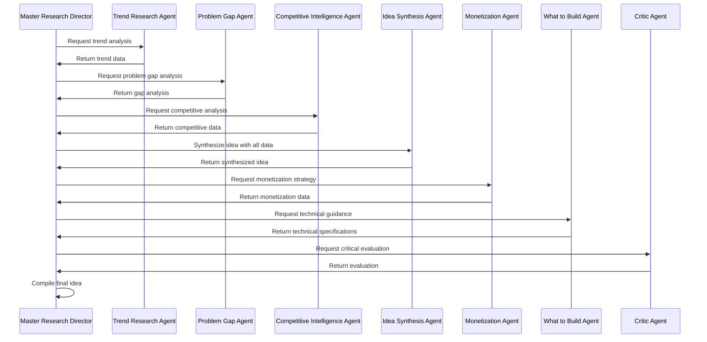

# AI Agent System

The core innovation of Nugget Finder is its sophisticated multi-agent AI system that breaks down business idea generation into specialized tasks, each handled by a dedicated AI agent with specific expertise and prompts.

## Overview

The AI agent system uses a master-coordinator pattern where a central "Research Director" orchestrates 8 specialized agents, each responsible for a specific aspect of business idea research and generation. This approach ensures comprehensive analysis while maintaining quality and consistency.

### Key Benefits
- **Specialized Expertise**: Each agent focuses on its domain of expertise
- **Parallel Processing**: Agents can work simultaneously for faster results
- **Quality Assurance**: Multiple validation layers ensure high-quality output
- **Scalability**: Easy to add new agents or modify existing ones
- **Consistency**: Standardized outputs across all generated ideas

## 🏗️ Agent Architecture

### Master Research Director

The **Master Research Director** serves as the orchestrator of the entire idea generation process. It coordinates all other agents and ensures the final output is coherent and actionable.

**Responsibilities:**
- Orchestrates the entire generation process
- Manages agent communication and data flow
- Ensures quality and consistency of outputs
- Handles error recovery and fallback strategies

**Key Functions:**
```typescript
interface MasterResearchDirector {
  async execute(context: AgentContext): Promise<SynthesizedIdea>;
  async coordinateAgents(agents: Agent[]): Promise<void>;
  async validateOutput(output: any): Promise<boolean>;
  async handleErrors(error: Error): Promise<void>;
}
```

### Trend Research Agent

The **Trend Research Agent** analyzes current market trends, technological developments, and social changes to identify emerging opportunities.

**Responsibilities:**
- Identifies market trends and opportunities
- Analyzes technology breakthroughs
- Monitors social and economic changes
- Provides trend strength scoring

**Output Structure:**
```typescript
interface TrendData {
  title: string;
  description: string;
  trendStrength: number; // 1-10 scale
  catalystType: CatalystType;
  timingUrgency: number; // 1-10 scale
  supportingData: {
    marketSignals: string[];
    technologySignals: string[];
    socialSignals: string[];
    economicSignals: string[];
  };
}
```

**Example Output:**
```json
{
  "title": "AI-Powered Personal Finance Management",
  "description": "Growing demand for automated financial planning tools",
  "trendStrength": 8,
  "catalystType": "TECHNOLOGY_BREAKTHROUGH",
  "timingUrgency": 7,
  "supportingData": {
    "marketSignals": ["Rising fintech adoption", "Increased personal savings focus"],
    "technologySignals": ["Advanced AI models", "Open banking APIs"],
    "socialSignals": ["Financial literacy awareness", "Remote work lifestyle"],
    "economicSignals": ["Inflation concerns", "Investment democratization"]
  }
}
```

### Problem Gap Agent

The **Problem Gap Agent** identifies market gaps, customer pain points, and unmet needs that represent business opportunities.

**Responsibilities:**
- Identifies market gaps and problems
- Analyzes customer pain points
- Evaluates problem severity and impact
- Provides opportunity scoring

**Output Structure:**
```typescript
interface ProblemGapData {
  gaps: Array<{
    title: string;
    description: string;
    impact: string;
    target: string;
    opportunity: string;
    severity: number; // 1-10 scale
    marketSize: number; // Estimated market size
  }>;
  summary: string;
  totalOpportunityScore: number;
}
```

**Example Output:**
```json
{
  "gaps": [
    {
      "title": "Time Management for Remote Workers",
      "description": "Remote workers struggle with work-life balance and productivity tracking",
      "impact": "Reduced productivity, increased burnout, poor work-life balance",
      "target": "Remote workers, freelancers, digital nomads",
      "opportunity": "AI-powered time tracking and productivity optimization",
      "severity": 8,
      "marketSize": 50000000
    }
  ],
  "summary": "Remote work has created new challenges in time management and productivity tracking",
  "totalOpportunityScore": 7.5
}
```

### Competitive Intelligence Agent

The **Competitive Intelligence Agent** analyzes the competitive landscape, identifies competitors, and determines market positioning opportunities.

**Responsibilities:**
- Analyzes direct and indirect competitors
- Identifies market concentration levels
- Evaluates competitive advantages
- Provides positioning recommendations

**Output Structure:**
```typescript
interface CompetitiveData {
  competition: {
    marketConcentrationLevel: MarketConcentrationLevel;
    marketConcentrationJustification: string;
    directCompetitors: Array<{
      name: string;
      justification: string;
      strengths: string[];
      weaknesses: string[];
    }>;
    indirectCompetitors: Array<{
      name: string;
      justification: string;
      strengths: string[];
      weaknesses: string[];
    }>;
    competitorFailurePoints: string[];
    unfairAdvantage: string[];
    moat: string[];
    competitivePositioningScore: number;
  };
  positioning: {
    name: string;
    targetSegment: string;
    valueProposition: string;
    keyDifferentiators: string[];
  };
}
```

**Example Output:**
```json
{
  "competition": {
    "marketConcentrationLevel": "MEDIUM",
    "marketConcentrationJustification": "Several established players but no clear market leader",
    "directCompetitors": [
      {
        "name": "RescueTime",
        "justification": "Time tracking and productivity analysis",
        "strengths": ["Established user base", "Comprehensive analytics"],
        "weaknesses": ["Complex interface", "High pricing"]
      }
    ],
    "competitivePositioningScore": 7,
    "unfairAdvantage": ["AI-first approach", "Simplified UX"],
    "moat": ["Proprietary algorithms", "Network effects"]
  },
  "positioning": {
    "name": "SmartTime - AI-Powered Time Intelligence",
    "targetSegment": "Remote workers seeking simplicity",
    "valueProposition": "Effortless time tracking with AI insights",
    "keyDifferentiators": ["Zero manual input", "Predictive insights", "Simple interface"]
  }
}
```

### Idea Synthesis Agent

The **Idea Synthesis Agent** combines research from other agents to create coherent, actionable startup ideas.

**Responsibilities:**
- Synthesizes research into coherent ideas
- Validates market fit and feasibility
- Creates compelling narratives
- Provides confidence scoring

**Output Structure:**
```typescript
interface SynthesizedIdea {
  title: string;
  description: string;
  executiveSummary: string;
  problemSolution: string;
  problemStatement: string;
  innovationLevel: number; // 1-10 scale
  timeToMarket: number; // Months to MVP
  confidenceScore: number; // 1-10 scale
  narrativeHook: string;
  targetKeywords: string[];
  urgencyLevel: number; // 1-10 scale
  executionComplexity: number; // 1-10 scale
  tags: string[];
  scoring: {
    totalScore: number;
    problemSeverity: number;
    founderMarketFit: number;
    technicalFeasibility: number;
    monetizationPotential: number;
    urgencyScore: number;
    marketTimingScore: number;
    executionDifficulty: number;
    moatStrength: number;
    regulatoryRisk: number;
  };
}
```

**Example Output:**
```json
{
  "title": "TimeFlow - AI-Powered Time Intelligence Platform",
  "description": "An AI-powered platform that automatically tracks time and provides intelligent insights to help remote workers optimize productivity and work-life balance.",
  "executiveSummary": "TimeFlow solves the growing problem of time management for remote workers by providing effortless, AI-powered time tracking and productivity insights.",
  "problemSolution": "Automated time tracking with AI insights and productivity recommendations",
  "confidenceScore": 8,
  "narrativeHook": "Remote workers waste 2 hours daily on manual time tracking. TimeFlow eliminates this with AI.",
  "targetKeywords": ["time tracking", "productivity", "remote work", "AI"],
  "urgencyLevel": 7,
  "executionComplexity": 6,
  "tags": ["productivity", "AI", "remote-work", "time-management"]
}
```

### Monetization Agent

The **Monetization Agent** develops revenue models, pricing strategies, and financial projections for generated ideas.

**Responsibilities:**
- Develops revenue models and pricing strategies
- Creates financial projections
- Analyzes market pricing sensitivity
- Provides business scoring

**Output Structure:**
```typescript
interface MonetizationData {
  primaryModel: string;
  pricingStrategy: string;
  businessScore: number; // 1-10 scale
  confidence: number; // 1-10 scale
  revenueModelValidation: string;
  pricingSensitivity: string;
  revenueStreams: Array<{
    name: string;
    description: string;
    percentage: number; // % of total revenue
  }>;
  keyMetrics: {
    ltv: number; // Lifetime Value
    cac: number; // Customer Acquisition Cost
    ltvCacRatio: number;
    paybackPeriod: number; // Months
    runway: number; // Months
    breakEvenPoint: string;
  };
  financialProjections: Array<{
    year: number;
    revenue: number;
    costs: number;
    netMargin: number;
    revenueGrowth: number;
  }>;
}
```

**Example Output:**
```json
{
  "primaryModel": "SaaS Subscription",
  "pricingStrategy": "Freemium with premium tiers",
  "businessScore": 8.5,
  "confidence": 7,
  "revenueStreams": [
    {
      "name": "Premium Subscriptions",
      "description": "Monthly/annual premium plans",
      "percentage": 80
    },
    {
      "name": "Enterprise Licenses",
      "description": "Custom enterprise solutions",
      "percentage": 20
    }
  ],
  "keyMetrics": {
    "ltv": 1200,
    "cac": 150,
    "ltvCacRatio": 8.0,
    "paybackPeriod": 6,
    "runway": 18,
    "breakEvenPoint": "Month 8"
  }
}
```

### What to Build Agent

The **What to Build Agent** provides technical implementation guidance, architecture recommendations, and development roadmaps.

**Responsibilities:**
- Defines technical architecture
- Recommends technology stack
- Creates implementation roadmap
- Provides development guidance

**Output Structure:**
```typescript
interface WhatToBuildData {
  platformDescription: string;
  coreFeaturesSummary: string[];
  userInterfaces: string[];
  keyIntegrations: string[];
  pricingStrategyBuildRecommendation: string;
  technicalArchitecture: {
    frontend: string[];
    backend: string[];
    database: string[];
    infrastructure: string[];
  };
  developmentPhases: Array<{
    phase: string;
    duration: string;
    features: string[];
    resources: string[];
  }>;
}
```

**Example Output:**
```json
{
  "platformDescription": "A web-based time tracking platform with mobile apps, featuring AI-powered insights and productivity recommendations",
  "coreFeaturesSummary": [
    "Automatic time tracking",
    "AI-powered insights",
    "Productivity recommendations",
    "Team collaboration features"
  ],
  "userInterfaces": [
    "Web Dashboard",
    "Mobile App (iOS/Android)",
    "Browser Extension",
    "Desktop App"
  ],
  "keyIntegrations": [
    "Calendar APIs (Google, Outlook)",
    "Project Management Tools (Asana, Trello)",
    "Communication Platforms (Slack, Teams)",
    "Analytics Tools (Google Analytics, Mixpanel)"
  ],
  "technicalArchitecture": {
    "frontend": ["React", "Next.js", "TypeScript"],
    "backend": ["Node.js", "Elysia", "tRPC"],
    "database": ["PostgreSQL", "Redis"],
    "infrastructure": ["AWS", "Docker", "Kubernetes"]
  }
}
```

### Critic Agent

The **Critic Agent** evaluates ideas critically, identifies potential issues, and provides risk assessments.

**Responsibilities:**
- Evaluates idea feasibility and risks
- Identifies potential challenges
- Provides critical feedback
- Scores idea quality

**Output Structure:**
```typescript
interface CriticEvaluation {
  overallScore: number; // 1-10 scale
  strengths: string[];
  weaknesses: string[];
  risks: Array<{
    category: string;
    description: string;
    severity: number; // 1-10 scale
    mitigation: string;
  }>;
  recommendations: string[];
  feasibilityAssessment: {
    technical: number; // 1-10 scale
    market: number; // 1-10 scale
    financial: number; // 1-10 scale
    operational: number; // 1-10 scale
  };
}
```

**Example Output:**
```json
{
  "overallScore": 7.5,
  "strengths": [
    "Clear market need",
    "Strong competitive positioning",
    "Scalable business model"
  ],
  "weaknesses": [
    "High development complexity",
    "Privacy concerns with time tracking",
    "Market saturation in productivity tools"
  ],
  "risks": [
    {
      "category": "Technical",
      "description": "AI model accuracy and reliability",
      "severity": 6,
      "mitigation": "Extensive testing and fallback mechanisms"
    }
  ],
  "feasibilityAssessment": {
    "technical": 7,
    "market": 8,
    "financial": 8,
    "operational": 6
  }
}
```

## 🔄 Agent Communication Flow

### Sequential Processing



### Data Flow Between Agents

```typescript
interface AgentDataFlow {
  trendData: TrendData;
  problemGapData: ProblemGapData;
  competitiveData: CompetitiveData;
  synthesizedIdea: SynthesizedIdea;
  monetizationData: MonetizationData;
  whatToBuildData: WhatToBuildData;
  criticEvaluation: CriticEvaluation;
}
```

## 🎯 Agent Configuration

### Dynamic Prompt Management

The system uses dynamic prompts that can be modified through the admin dashboard:

```typescript
interface AgentPrompt {
  agentName: string;
  promptKey: string;
  promptContent: string;
  isActive: boolean;
  updatedBy: string;
  updatedAt: Date;
}
```

### Example Prompts

**Trend Research Agent:**
```text
You are a market research expert specializing in identifying emerging trends and opportunities. Analyze current market conditions and identify trends that could lead to business opportunities. Focus on:

1. Technology breakthroughs and innovations
2. Social and behavioral changes
3. Economic and regulatory shifts
4. Market gaps and unmet needs

Provide detailed analysis with supporting evidence and trend strength scoring.
```

**Idea Synthesis Agent:**
```text
You are the Trend Architect - a world-class startup idea synthesizer who transforms market research into compelling, immediately actionable business opportunities. Your expertise lies in combining trend analysis, problem identification, and competitive intelligence into cohesive startup concepts that feel inevitable and urgent.

CRITICAL REQUIREMENTS:
- Use simple, direct language that anyone can understand
- Focus on consumer problems and solutions
- Avoid technical jargon and buzzwords
- Create ideas that are immediately actionable
```

## 📊 Agent Performance Metrics

### Quality Metrics

- **Idea Completeness**: Percentage of required fields populated
- **Idea Quality Score**: Average score from critic agent
- **Market Validation**: Alignment with trend and gap analysis
- **Technical Feasibility**: Implementation complexity assessment

### Performance Monitoring

```typescript
interface AgentMetrics {
  agentName: string;
  executionTime: number;
  successRate: number;
  errorRate: number;
  outputQuality: number;
  costPerExecution: number;
}
```

## 🔧 Agent Customization

### Adding New Agents

To add a new agent to the system:

1. **Create Agent Class:**
```typescript
export class NewAgent {
  static async execute(context: AgentContext): Promise<AgentOutput> {
    // Agent implementation
  }
}
```

2. **Update Master Research Director:**
```typescript
// Add to agent coordination
const newAgent = new NewAgent();
const result = await newAgent.execute(context);
```

3. **Add to Database Schema:**
```prisma
model NewAgentOutput {
  id String @id @default(uuid())
  // Agent-specific fields
  dailyIdeaId String @unique
  dailyIdea DailyIdea @relation(fields: [dailyIdeaId], references: [id])
}
```

### Agent Configuration

```typescript
interface AgentConfig {
  name: string;
  enabled: boolean;
  timeout: number;
  retries: number;
  model: string;
  temperature: number;
  maxTokens: number;
}
```

## 🚀 Future Enhancements

### Planned Improvements

1. **Agent Learning**: Implement feedback loops for agent improvement
2. **Multi-Model Support**: Use different AI models for different agents
3. **Parallel Processing**: Run compatible agents in parallel
4. **Agent Specialization**: Create domain-specific agent variants
5. **Real-time Collaboration**: Allow agents to collaborate in real-time

### Scalability Considerations

- **Agent Pooling**: Maintain pools of agents for high availability
- **Load Balancing**: Distribute agent workloads across multiple instances
- **Caching**: Cache agent outputs for similar inputs
- **Cost Optimization**: Use cheaper models for simple tasks

This AI agent system provides the foundation for generating high-quality, validated startup ideas with comprehensive market analysis and implementation guidance.


