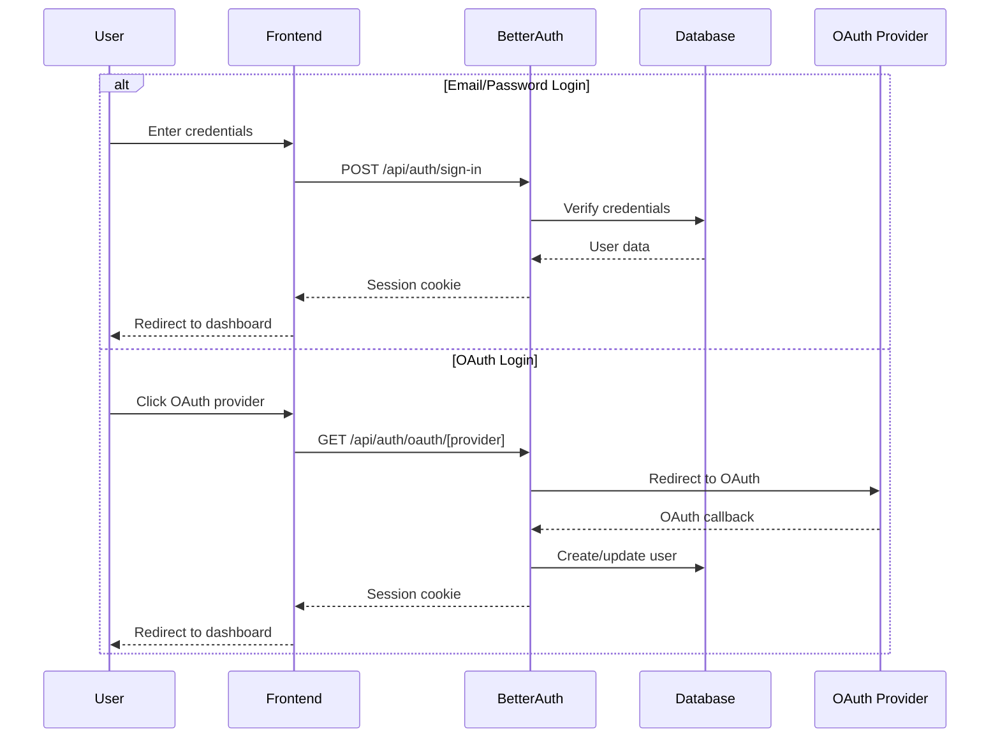

# Authentication System

Nugget Finder uses Better Auth for comprehensive authentication management, providing secure user authentication with multiple providers and session management.

## Overview

The authentication system provides:
- Multi-provider authentication (Email/Password, Google, GitHub)
- Secure session management with JWT tokens
- Role-based access control (RBAC)
- Email verification and password reset
- CSRF protection and security headers

## Authentication Flow



## Configuration

### Better Auth Setup

**apps/server/src/lib/auth.ts**
```typescript
import { betterAuth } from "better-auth";
import { prismaAdapter } from "better-auth/adapters/prisma";
import { prisma } from "./prisma";

export const auth = betterAuth({
  database: prismaAdapter(prisma, {
    provider: "postgresql", // or "sqlite" for development
  }),
  
  // Email and password authentication
  emailAndPassword: {
    enabled: true,
    requireEmailVerification: true,
    minPasswordLength: 8,
    maxPasswordLength: 128,
  },

  // Social providers
  socialProviders: {
    google: {
      clientId: process.env.GOOGLE_CLIENT_ID!,
      clientSecret: process.env.GOOGLE_CLIENT_SECRET!,
    },
    github: {
      clientId: process.env.GITHUB_CLIENT_ID!,
      clientSecret: process.env.GITHUB_CLIENT_SECRET!,
    },
  },

  // Session configuration
  session: {
    expiresIn: 60 * 60 * 24 * 7, // 1 week
    updateAge: 60 * 60 * 24, // 1 day
    cookieCache: {
      enabled: true,
      maxAge: 5 * 60, // 5 minutes
    },
  },

  // Security settings
  advanced: {
    generateId: () => crypto.randomUUID(),
    crossSubDomainCookies: {
      enabled: false,
    },
    useSecureCookies: process.env.NODE_ENV === "production",
    defaultCookieAttributes: {
      sameSite: "lax",
      httpOnly: true,
      secure: process.env.NODE_ENV === "production",
    },
  },

  // Rate limiting
  rateLimit: {
    window: 60, // 1 minute
    max: 100, // 100 requests per window
  },

  // Plugins
  plugins: [
    // Add custom plugins here
  ],
});

export type Session = typeof auth.$Infer.Session;
export type User = typeof auth.$Infer.User;
```

### Environment Variables

```env
# Better Auth Configuration
BETTER_AUTH_SECRET="your-secret-key-min-32-chars"
BETTER_AUTH_URL="http://localhost:3001" # or production URL

# OAuth Providers
GOOGLE_CLIENT_ID="your-google-client-id"
GOOGLE_CLIENT_SECRET="your-google-client-secret"
GITHUB_CLIENT_ID="your-github-client-id"
GITHUB_CLIENT_SECRET="your-github-client-secret"

# Email Service (for verification)
EMAIL_FROM="noreply@yourdomain.com"
EMAIL_SERVER_HOST="smtp.yourdomain.com"
EMAIL_SERVER_PORT="587"
EMAIL_SERVER_USER="your-smtp-user"
EMAIL_SERVER_PASSWORD="your-smtp-password"
```

## Database Schema

### User Model
```prisma
model User {
  id            String    @id @default(cuid())
  name          String?
  email         String    @unique
  emailVerified DateTime?
  image         String?
  role          UserRole  @default(USER)
  
  // Usage tracking
  claimLimit    Int       @default(3)
  claimsUsed    Int       @default(0)
  saveLimit     Int       @default(50)
  savesUsed     Int       @default(0)
  viewLimit     Int       @default(100)
  viewsUsed     Int       @default(0)
  lastViewReset DateTime  @default(now())
  
  // Relationships
  accounts      Account[]
  sessions      Session[]
  subscriptions Subscription[]
  savedIdeas    SavedIdeas[]
  claimedIdeas  ClaimedIdeas[]
  viewedIdeas   ViewedIdeas[]
  
  createdAt DateTime @default(now())
  updatedAt DateTime @updatedAt
}

enum UserRole {
  USER
  ADMIN
}

model Account {
  id                String  @id @default(cuid())
  userId            String
  type              String
  provider          String
  providerAccountId String
  refresh_token     String?
  access_token      String?
  expires_at        Int?
  token_type        String?
  scope             String?
  id_token          String?
  session_state     String?
  
  user User @relation(fields: [userId], references: [id], onDelete: Cascade)
  
  @@unique([provider, providerAccountId])
}

model Session {
  id           String   @id @default(cuid())
  sessionToken String   @unique
  userId       String
  expires      DateTime
  
  user User @relation(fields: [userId], references: [id], onDelete: Cascade)
}

model VerificationToken {
  identifier String
  token      String   @unique
  expires    DateTime
  
  @@unique([identifier, token])
}
```

## Frontend Integration

### Auth Hook (apps/web/src/hooks/useAuth.ts)
```typescript
import { useSession } from "better-auth/react";

export function useAuth() {
  const session = useSession();
  
  return {
    user: session.data?.user ?? null,
    isLoading: session.isPending,
    isAuthenticated: !!session.data?.user,
    signIn: session.signIn,
    signOut: session.signOut,
    signUp: session.signUp,
  };
}
```

### Authentication Components

#### Login Component
```typescript
// apps/web/src/components/auth/LoginForm.tsx
import { useState } from "react";
import { useAuth } from "@/hooks/useAuth";
import { Button } from "@/components/ui/button";
import { Input } from "@/components/ui/input";

export function LoginForm() {
  const [email, setEmail] = useState("");
  const [password, setPassword] = useState("");
  const [isLoading, setIsLoading] = useState(false);
  const { signIn } = useAuth();

  const handleSubmit = async (e: React.FormEvent) => {
    e.preventDefault();
    setIsLoading(true);
    
    try {
      await signIn.email({
        email,
        password,
        callbackURL: "/dashboard",
      });
    } catch (error) {
      console.error("Login failed:", error);
    } finally {
      setIsLoading(false);
    }
  };

  const handleOAuthSignIn = async (provider: "google" | "github") => {
    await signIn.social({
      provider,
      callbackURL: "/dashboard",
    });
  };

  return (
    <form onSubmit={handleSubmit} className="space-y-4">
      <Input
        type="email"
        placeholder="Email"
        value={email}
        onChange={(e) => setEmail(e.target.value)}
        required
      />
      <Input
        type="password"
        placeholder="Password"
        value={password}
        onChange={(e) => setPassword(e.target.value)}
        required
      />
      <Button type="submit" disabled={isLoading} className="w-full">
        {isLoading ? "Signing in..." : "Sign In"}
      </Button>
      
      <div className="flex gap-2">
        <Button
          type="button"
          variant="outline"
          onClick={() => handleOAuthSignIn("google")}
          className="flex-1"
        >
          Continue with Google
        </Button>
        <Button
          type="button"
          variant="outline"
          onClick={() => handleOAuthSignIn("github")}
          className="flex-1"
        >
          Continue with GitHub
        </Button>
      </div>
    </form>
  );
}
```

#### Protected Route Component
```typescript
// apps/web/src/components/auth/ProtectedRoute.tsx
import { useAuth } from "@/hooks/useAuth";
import { useRouter } from "next/navigation";
import { useEffect } from "react";

interface ProtectedRouteProps {
  children: React.ReactNode;
  requiredRole?: "USER" | "ADMIN";
}

export function ProtectedRoute({ 
  children, 
  requiredRole = "USER" 
}: ProtectedRouteProps) {
  const { user, isLoading, isAuthenticated } = useAuth();
  const router = useRouter();

  useEffect(() => {
    if (!isLoading) {
      if (!isAuthenticated) {
        router.push("/login");
        return;
      }
      
      if (requiredRole === "ADMIN" && user?.role !== "ADMIN") {
        router.push("/dashboard");
        return;
      }
    }
  }, [isAuthenticated, isLoading, user, requiredRole, router]);

  if (isLoading) {
    return <div>Loading...</div>;
  }

  if (!isAuthenticated) {
    return null;
  }

  if (requiredRole === "ADMIN" && user?.role !== "ADMIN") {
    return <div>Access denied</div>;
  }

  return <>{children}</>;
}
```

## API Integration

### Server-side Session Validation
```typescript
// apps/server/src/middleware/auth.ts
import { auth } from "@/lib/auth";
import type { Request, Response, NextFunction } from "express";

export async function requireAuth(
  req: Request,
  res: Response,
  next: NextFunction
) {
  try {
    const session = await auth.api.getSession({
      headers: req.headers as any,
    });

    if (!session) {
      return res.status(401).json({ error: "Unauthorized" });
    }

    req.user = session.user;
    req.session = session;
    next();
  } catch (error) {
    return res.status(401).json({ error: "Invalid session" });
  }
}

export function requireRole(role: "USER" | "ADMIN") {
  return (req: Request, res: Response, next: NextFunction) => {
    if (!req.user) {
      return res.status(401).json({ error: "Unauthorized" });
    }

    if (req.user.role !== role && req.user.role !== "ADMIN") {
      return res.status(403).json({ error: "Insufficient permissions" });
    }

    next();
  };
}
```

### tRPC Context with Authentication
```typescript
// apps/server/src/lib/trpc.ts
import { auth } from "@/lib/auth";
import { prisma } from "@/lib/prisma";

export async function createTRPCContext(opts: { req: any; res: any }) {
  const session = await auth.api.getSession({
    headers: opts.req.headers,
  });

  return {
    session,
    user: session?.user ?? null,
    prisma,
  };
}

export type Context = Awaited<ReturnType<typeof createTRPCContext>>;

// Middleware for authenticated procedures
export const requireAuth = middleware(({ ctx, next }) => {
  if (!ctx.session?.user) {
    throw new TRPCError({
      code: "UNAUTHORIZED",
      message: "You must be logged in to access this resource",
    });
  }
  
  return next({
    ctx: {
      ...ctx,
      user: ctx.session.user,
    },
  });
});

// Middleware for admin-only procedures
export const requireAdmin = requireAuth.unstable_pipe(({ ctx, next }) => {
  if (ctx.user.role !== "ADMIN") {
    throw new TRPCError({
      code: "FORBIDDEN",
      message: "Admin access required",
    });
  }
  
  return next({ ctx });
});
```

## Role-Based Access Control

### User Roles
- **USER**: Standard user with basic access to idea generation
- **ADMIN**: Administrative access with system management capabilities

### Permission Matrix
| Feature | USER | ADMIN |
|---------|------|-------|
| Generate Ideas | ✅ | ✅ |
| Save Ideas | ✅ | ✅ |
| View Own History | ✅ | ✅ |
| Admin Dashboard | ❌ | ✅ |
| Manage Featured Ideas | ❌ | ✅ |
| View Analytics | ❌ | ✅ |
| Manage Users | ❌ | ✅ |
| System Settings | ❌ | ✅ |

## Security Features

### Password Security
- Minimum 8 characters length
- Bcrypt hashing with salt rounds
- Password strength validation
- Secure password reset flow

### Session Security
- HTTP-only cookies
- CSRF protection
- Secure cookies in production
- Session expiration and renewal
- Rate limiting on auth endpoints

### OAuth Security
- State parameter validation
- Nonce validation for OIDC
- Secure redirect URI validation
- Token validation and refresh

## Usage Examples

### Check Authentication Status
```typescript
// In React component
const { user, isAuthenticated } = useAuth();

if (isAuthenticated) {
  console.log(`Welcome, ${user.name}!`);
}
```

### Protect API Route
```typescript
// In tRPC procedure
export const protectedProcedure = publicProcedure
  .use(requireAuth)
  .query(async ({ ctx }) => {
    // User is guaranteed to be authenticated
    console.log(`User ID: ${ctx.user.id}`);
    return { message: "Hello authenticated user!" };
  });
```

### Admin-Only Feature
```typescript
// In React component
<ProtectedRoute requiredRole="ADMIN">
  <AdminDashboard />
</ProtectedRoute>
```

This authentication system provides a secure and flexible foundation for user management in the Nugget Finder platform.