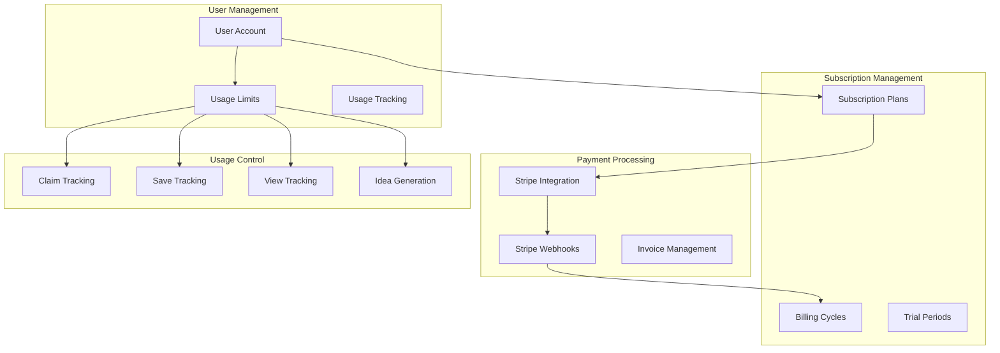

# Subscription System

Nugget Finder implements a comprehensive subscription management system using Stripe for payment processing, with flexible usage tracking and plan management capabilities.

## Overview

The subscription system provides:
- Multiple subscription tiers (FREE, BASIC, PRO, ENTERPRISE)
- Usage-based limits for different features
- Stripe integration for payment processing
- Flexible billing cycles and trial periods
- Usage analytics and reporting
- Plan upgrades and downgrades

## Subscription Architecture



## Subscription Plans

### Plan Structure

```typescript
interface SubscriptionPlan {
  id: string;
  name: "FREE" | "BASIC" | "PRO" | "ENTERPRISE";
  price: number; // Monthly price in cents
  features: {
    claimLimit: number; // -1 for unlimited
    saveLimit: number; // -1 for unlimited
    viewLimit: number; // Daily limit, -1 for unlimited
    ideaGenerationLimit: number; // Monthly limit, -1 for unlimited
    featuredAccess: boolean;
    premiumContent: boolean;
    apiAccess: boolean;
    prioritySupport: boolean;
    teamFeatures: boolean;
  };
  stripeProductId: string;
  stripePriceId: string;
}
```

### Available Plans

#### FREE Plan
- **Price**: $0/month
- **Claim Limit**: 3 total
- **Save Limit**: 50 total
- **View Limit**: 100 per day
- **Idea Generation**: 0 per month
- **Features**: Basic content access only

#### BASIC Plan
- **Price**: $29/month
- **Claim Limit**: Unlimited
- **Save Limit**: Unlimited
- **View Limit**: Unlimited
- **Idea Generation**: 10 per month
- **Features**: Premium content, basic support

#### PRO Plan
- **Price**: $99/month
- **Claim Limit**: Unlimited
- **Save Limit**: Unlimited
- **View Limit**: Unlimited
- **Idea Generation**: 50 per month
- **Features**: Full access, API access, priority support

#### ENTERPRISE Plan
- **Price**: $299/month
- **Claim Limit**: Unlimited
- **Save Limit**: Unlimited
- **View Limit**: Unlimited
- **Idea Generation**: Unlimited
- **Features**: All features, team management, custom integrations

## Database Schema

### Subscription Model
```prisma
model Subscription {
  id                   String   @id @default(cuid())
  plan                 String   // "FREE", "BASIC", "PRO", "ENTERPRISE"
  referenceId          String   @unique // User ID
  stripeCustomerId     String?
  stripeSubscriptionId String?
  status               String   @default("active") // "active", "canceled", "past_due"
  periodStart          DateTime
  periodEnd            DateTime
  cancelAtPeriodEnd    Boolean  @default(false)
  seats                Int      @default(1)
  trialStart           DateTime?
  trialEnd             DateTime?
  
  user User @relation(fields: [referenceId], references: [id], onDelete: Cascade)
  
  createdAt DateTime @default(now())
  updatedAt DateTime @updatedAt

  @@map("subscriptions")
}

model PaymentVerification {
  id                String   @id @default(cuid())
  userId            String   @unique
  transactionNumber String   @unique
  amount            Decimal
  currency          String   @default("USD")
  status            String   @default("pending") // "pending", "completed", "failed"
  
  user User @relation(fields: [userId], references: [id], onDelete: Cascade)
  
  createdAt DateTime @default(now())
  updatedAt DateTime @updatedAt

  @@map("payment_verifications")
}
```

### User Usage Tracking
```prisma
model User {
  // Usage limits and tracking
  claimLimit    Int      @default(3)
  claimsUsed    Int      @default(0)
  saveLimit     Int      @default(50)
  savesUsed     Int      @default(0)
  viewLimit     Int      @default(100)
  viewsUsed     Int      @default(0)
  lastViewReset DateTime @default(now())
  
  // Stripe integration
  stripeCustomerId String?
  
  // Relationships
  subscriptions Subscription[]
  paymentVerification PaymentVerification?
}
```

## Stripe Integration

### Stripe Configuration

**Environment Variables**:
```env
STRIPE_SECRET_KEY="sk_test_..." # or sk_live_ for production
STRIPE_PUBLISHABLE_KEY="pk_test_..." # or pk_live_ for production
STRIPE_WEBHOOK_SECRET="whsec_..."
NEXT_PUBLIC_STRIPE_PUBLISHABLE_KEY="pk_test_..."
```

**Stripe Client Setup**:
```typescript
// apps/server/src/lib/stripe.ts
import Stripe from 'stripe';

export const stripe = new Stripe(process.env.STRIPE_SECRET_KEY!, {
  apiVersion: '2023-10-16',
  typescript: true,
});

// Product and price configuration
export const STRIPE_PLANS = {
  BASIC: {
    productId: 'prod_basic',
    priceId: 'price_basic_monthly',
    price: 2900, // $29.00 in cents
  },
  PRO: {
    productId: 'prod_pro',
    priceId: 'price_pro_monthly',
    price: 9900, // $99.00 in cents
  },
  ENTERPRISE: {
    productId: 'prod_enterprise',
    priceId: 'price_enterprise_monthly',
    price: 29900, // $299.00 in cents
  },
};
```

### Subscription Creation

```typescript
// apps/server/src/lib/subscription.ts
export class SubscriptionService {
  async createCheckoutSession(
    userId: string,
    priceId: string,
    successUrl: string,
    cancelUrl: string
  ): Promise<Stripe.Checkout.Session> {
    const user = await prisma.user.findUnique({
      where: { id: userId },
    });

    if (!user) {
      throw new Error('User not found');
    }

    // Create or retrieve Stripe customer
    let customerId = user.stripeCustomerId;
    if (!customerId) {
      const customer = await stripe.customers.create({
        email: user.email,
        name: user.name || undefined,
        metadata: {
          userId: user.id,
        },
      });
      
      customerId = customer.id;
      
      // Update user with Stripe customer ID
      await prisma.user.update({
        where: { id: userId },
        data: { stripeCustomerId: customerId },
      });
    }

    // Create checkout session
    const session = await stripe.checkout.sessions.create({
      customer: customerId,
      payment_method_types: ['card'],
      line_items: [
        {
          price: priceId,
          quantity: 1,
        },
      ],
      mode: 'subscription',
      success_url: successUrl,
      cancel_url: cancelUrl,
      subscription_data: {
        trial_period_days: 14, // 14-day free trial
        metadata: {
          userId: user.id,
        },
      },
    });

    return session;
  }

  async cancelSubscription(userId: string): Promise<void> {
    const subscription = await prisma.subscription.findUnique({
      where: { referenceId: userId },
    });

    if (!subscription || !subscription.stripeSubscriptionId) {
      throw new Error('Subscription not found');
    }

    // Cancel at period end to maintain access
    await stripe.subscriptions.update(subscription.stripeSubscriptionId, {
      cancel_at_period_end: true,
    });

    // Update database
    await prisma.subscription.update({
      where: { referenceId: userId },
      data: { cancelAtPeriodEnd: true },
    });
  }
}
```

### Webhook Handling

```typescript
// apps/server/src/routes/webhooks/stripe.ts
import { stripe } from '@/lib/stripe';
import { prisma } from '@/lib/prisma';

export async function handleStripeWebhook(req: Request): Promise<Response> {
  const sig = req.headers.get('stripe-signature');
  const body = await req.text();

  let event: Stripe.Event;

  try {
    event = stripe.webhooks.constructEvent(
      body,
      sig!,
      process.env.STRIPE_WEBHOOK_SECRET!
    );
  } catch (err) {
    console.error('Webhook signature verification failed:', err);
    return new Response('Webhook signature verification failed', { status: 400 });
  }

  switch (event.type) {
    case 'customer.subscription.created':
      await handleSubscriptionCreated(event.data.object as Stripe.Subscription);
      break;
      
    case 'customer.subscription.updated':
      await handleSubscriptionUpdated(event.data.object as Stripe.Subscription);
      break;
      
    case 'customer.subscription.deleted':
      await handleSubscriptionDeleted(event.data.object as Stripe.Subscription);
      break;
      
    case 'invoice.payment_succeeded':
      await handlePaymentSucceeded(event.data.object as Stripe.Invoice);
      break;
      
    case 'invoice.payment_failed':
      await handlePaymentFailed(event.data.object as Stripe.Invoice);
      break;

    default:
      console.log(`Unhandled event type: ${event.type}`);
  }

  return new Response(JSON.stringify({ received: true }), {
    status: 200,
    headers: { 'Content-Type': 'application/json' },
  });
}

async function handleSubscriptionCreated(subscription: Stripe.Subscription): Promise<void> {
  const userId = subscription.metadata.userId;
  if (!userId) return;

  const plan = getPlanFromPriceId(subscription.items.data[0].price.id);
  
  await prisma.subscription.upsert({
    where: { referenceId: userId },
    create: {
      referenceId: userId,
      plan,
      stripeCustomerId: subscription.customer as string,
      stripeSubscriptionId: subscription.id,
      status: subscription.status,
      periodStart: new Date(subscription.current_period_start * 1000),
      periodEnd: new Date(subscription.current_period_end * 1000),
      trialStart: subscription.trial_start 
        ? new Date(subscription.trial_start * 1000) 
        : null,
      trialEnd: subscription.trial_end 
        ? new Date(subscription.trial_end * 1000) 
        : null,
    },
    update: {
      plan,
      status: subscription.status,
      periodStart: new Date(subscription.current_period_start * 1000),
      periodEnd: new Date(subscription.current_period_end * 1000),
      cancelAtPeriodEnd: subscription.cancel_at_period_end,
    },
  });

  // Update user limits based on plan
  await updateUserLimits(userId, plan);
}

function getPlanFromPriceId(priceId: string): string {
  const planMap = {
    [STRIPE_PLANS.BASIC.priceId]: 'BASIC',
    [STRIPE_PLANS.PRO.priceId]: 'PRO',
    [STRIPE_PLANS.ENTERPRISE.priceId]: 'ENTERPRISE',
  };
  
  return planMap[priceId] || 'FREE';
}
```

## Usage Tracking System

### Usage Limits Service

```typescript
// apps/server/src/lib/usage.ts
export class UsageTrackingService {
  async checkClaimLimit(userId: string): Promise<boolean> {
    const user = await this.getUserWithLimits(userId);
    return user.claimLimit === -1 || user.claimsUsed < user.claimLimit;
  }

  async checkSaveLimit(userId: string): Promise<boolean> {
    const user = await this.getUserWithLimits(userId);
    return user.saveLimit === -1 || user.savesUsed < user.saveLimit;
  }

  async checkViewLimit(userId: string): Promise<boolean> {
    const user = await this.getUserWithLimits(userId);
    
    // Reset daily view count if needed
    await this.resetDailyViewsIfNeeded(user);
    
    const updatedUser = await this.getUserWithLimits(userId);
    return updatedUser.viewLimit === -1 || updatedUser.viewsUsed < updatedUser.viewLimit;
  }

  async incrementClaimsUsed(userId: string): Promise<void> {
    await prisma.user.update({
      where: { id: userId },
      data: { claimsUsed: { increment: 1 } },
    });
  }

  async incrementSavesUsed(userId: string): Promise<void> {
    await prisma.user.update({
      where: { id: userId },
      data: { savesUsed: { increment: 1 } },
    });
  }

  async incrementViewsUsed(userId: string): Promise<void> {
    await prisma.user.update({
      where: { id: userId },
      data: { viewsUsed: { increment: 1 } },
    });
  }

  private async resetDailyViewsIfNeeded(user: User): Promise<void> {
    const now = new Date();
    const lastReset = new Date(user.lastViewReset);
    
    // Check if it's a new day
    if (now.getDate() !== lastReset.getDate() || 
        now.getMonth() !== lastReset.getMonth() || 
        now.getFullYear() !== lastReset.getFullYear()) {
      
      await prisma.user.update({
        where: { id: user.id },
        data: {
          viewsUsed: 0,
          lastViewReset: now,
        },
      });
    }
  }

  private async getUserWithLimits(userId: string): Promise<User> {
    const user = await prisma.user.findUnique({
      where: { id: userId },
    });

    if (!user) {
      throw new Error('User not found');
    }

    return user;
  }
}

async function updateUserLimits(userId: string, plan: string): Promise<void> {
  const limits = PLAN_LIMITS[plan];
  
  await prisma.user.update({
    where: { id: userId },
    data: {
      claimLimit: limits.claimLimit,
      saveLimit: limits.saveLimit,
      viewLimit: limits.viewLimit,
    },
  });
}

const PLAN_LIMITS = {
  FREE: {
    claimLimit: 3,
    saveLimit: 50,
    viewLimit: 100,
  },
  BASIC: {
    claimLimit: -1, // Unlimited
    saveLimit: -1,  // Unlimited
    viewLimit: -1,  // Unlimited
  },
  PRO: {
    claimLimit: -1, // Unlimited
    saveLimit: -1,  // Unlimited
    viewLimit: -1,  // Unlimited
  },
  ENTERPRISE: {
    claimLimit: -1, // Unlimited
    saveLimit: -1,  // Unlimited
    viewLimit: -1,  // Unlimited
  },
};
```

## Frontend Integration

### Subscription Hook

```typescript
// apps/web/src/hooks/useSubscription.ts
import { trpc } from '@/lib/trpc';

export function useSubscription() {
  const utils = trpc.useContext();
  
  const { data: subscription, isLoading } = trpc.subscription.getCurrent.useQuery();
  const { data: usage } = trpc.subscription.getUsage.useQuery();
  
  const createCheckoutSession = trpc.subscription.createCheckoutSession.useMutation({
    onSuccess: (sessionUrl) => {
      window.location.href = sessionUrl;
    },
  });
  
  const cancelSubscription = trpc.subscription.cancel.useMutation({
    onSuccess: () => {
      utils.subscription.getCurrent.invalidate();
    },
  });

  return {
    subscription,
    usage,
    isLoading,
    createCheckoutSession: createCheckoutSession.mutate,
    cancelSubscription: cancelSubscription.mutate,
    isCreatingCheckout: createCheckoutSession.isLoading,
    isCanceling: cancelSubscription.isLoading,
  };
}
```

### Subscription UI Components

```typescript
// apps/web/src/components/subscription/PricingPlans.tsx
import { useSubscription } from '@/hooks/useSubscription';
import { Button } from '@/components/ui/button';
import { Card } from '@/components/ui/card';

const PLANS = [
  {
    name: 'FREE',
    price: 0,
    priceId: null,
    features: [
      '3 idea claims total',
      '50 saved ideas',
      '100 daily views',
      'Basic content access',
    ],
  },
  {
    name: 'BASIC',
    price: 29,
    priceId: 'price_basic_monthly',
    features: [
      'Unlimited claims',
      'Unlimited saves',
      'Unlimited views',
      '10 custom ideas/month',
      'Premium content access',
    ],
  },
  {
    name: 'PRO',
    price: 99,
    priceId: 'price_pro_monthly',
    popular: true,
    features: [
      'Everything in Basic',
      '50 custom ideas/month',
      'API access',
      'Priority support',
      'Advanced analytics',
    ],
  },
  {
    name: 'ENTERPRISE',
    price: 299,
    priceId: 'price_enterprise_monthly',
    features: [
      'Everything in Pro',
      'Unlimited custom ideas',
      'Team management',
      'Custom integrations',
      'Dedicated support',
    ],
  },
];

export function PricingPlans() {
  const { subscription, createCheckoutSession } = useSubscription();

  const handleUpgrade = (priceId: string) => {
    createCheckoutSession({
      priceId,
      successUrl: `${window.location.origin}/dashboard?upgraded=true`,
      cancelUrl: `${window.location.origin}/pricing`,
    });
  };

  return (
    <div className="grid grid-cols-1 md:grid-cols-2 lg:grid-cols-4 gap-6">
      {PLANS.map((plan) => (
        <Card key={plan.name} className={`p-6 ${plan.popular ? 'ring-2 ring-blue-500' : ''}`}>
          <div className="text-center">
            <h3 className="text-2xl font-bold">{plan.name}</h3>
            <div className="text-3xl font-bold mt-4">
              ${plan.price}
              <span className="text-sm text-muted-foreground">/month</span>
            </div>
          </div>
          
          <ul className="mt-6 space-y-2">
            {plan.features.map((feature) => (
              <li key={feature} className="flex items-center">
                <Check className="h-4 w-4 text-green-500 mr-2" />
                {feature}
              </li>
            ))}
          </ul>
          
          <div className="mt-6">
            {plan.priceId ? (
              <Button
                onClick={() => handleUpgrade(plan.priceId!)}
                disabled={subscription?.plan === plan.name}
                className="w-full"
              >
                {subscription?.plan === plan.name ? 'Current Plan' : 'Upgrade'}
              </Button>
            ) : (
              <Button variant="outline" disabled className="w-full">
                Current Plan
              </Button>
            )}
          </div>
        </Card>
      ))}
    </div>
  );
}
```

### Usage Display Component

```typescript
// apps/web/src/components/subscription/UsageIndicator.tsx
import { useSubscription } from '@/hooks/useSubscription';
import { Progress } from '@/components/ui/progress';

export function UsageIndicator() {
  const { usage, subscription } = useSubscription();

  if (!usage) return null;

  const getUsagePercentage = (used: number, limit: number) => {
    if (limit === -1) return 0; // Unlimited
    return Math.min((used / limit) * 100, 100);
  };

  return (
    <div className="space-y-4 p-4 border rounded-lg">
      <h3 className="font-semibold">Usage Overview</h3>
      
      {/* Claims Usage */}
      <div>
        <div className="flex justify-between text-sm">
          <span>Claims Used</span>
          <span>
            {usage.claimsUsed} / {usage.claimLimit === -1 ? '∞' : usage.claimLimit}
          </span>
        </div>
        {usage.claimLimit !== -1 && (
          <Progress 
            value={getUsagePercentage(usage.claimsUsed, usage.claimLimit)} 
            className="mt-1"
          />
        )}
      </div>

      {/* Saves Usage */}
      <div>
        <div className="flex justify-between text-sm">
          <span>Saves Used</span>
          <span>
            {usage.savesUsed} / {usage.saveLimit === -1 ? '∞' : usage.saveLimit}
          </span>
        </div>
        {usage.saveLimit !== -1 && (
          <Progress 
            value={getUsagePercentage(usage.savesUsed, usage.saveLimit)} 
            className="mt-1"
          />
        )}
      </div>

      {/* Views Usage */}
      <div>
        <div className="flex justify-between text-sm">
          <span>Daily Views</span>
          <span>
            {usage.viewsUsed} / {usage.viewLimit === -1 ? '∞' : usage.viewLimit}
          </span>
        </div>
        {usage.viewLimit !== -1 && (
          <Progress 
            value={getUsagePercentage(usage.viewsUsed, usage.viewLimit)} 
            className="mt-1"
          />
        )}
      </div>

      {subscription?.plan === 'FREE' && (
        <div className="pt-2 border-t">
          <Button variant="outline" size="sm" className="w-full">
            Upgrade for Unlimited Access
          </Button>
        </div>
      )}
    </div>
  );
}
```

## tRPC API Routes

### Subscription Router

```typescript
// apps/server/src/routers/subscription.ts
import { z } from 'zod';
import { router, protectedProcedure } from '@/lib/trpc';
import { SubscriptionService } from '@/lib/subscription';
import { UsageTrackingService } from '@/lib/usage';

const subscriptionService = new SubscriptionService();
const usageService = new UsageTrackingService();

export const subscriptionRouter = router({
  getCurrent: protectedProcedure
    .query(async ({ ctx }) => {
      return prisma.subscription.findUnique({
        where: { referenceId: ctx.user.id },
      });
    }),

  getUsage: protectedProcedure
    .query(async ({ ctx }) => {
      const user = await prisma.user.findUnique({
        where: { id: ctx.user.id },
        select: {
          claimLimit: true,
          claimsUsed: true,
          saveLimit: true,
          savesUsed: true,
          viewLimit: true,
          viewsUsed: true,
          lastViewReset: true,
        },
      });

      return user;
    }),

  createCheckoutSession: protectedProcedure
    .input(z.object({
      priceId: z.string(),
      successUrl: z.string().url(),
      cancelUrl: z.string().url(),
    }))
    .mutation(async ({ ctx, input }) => {
      const session = await subscriptionService.createCheckoutSession(
        ctx.user.id,
        input.priceId,
        input.successUrl,
        input.cancelUrl
      );

      return session.url;
    }),

  cancel: protectedProcedure
    .mutation(async ({ ctx }) => {
      await subscriptionService.cancelSubscription(ctx.user.id);
      return { success: true };
    }),

  checkClaimLimit: protectedProcedure
    .query(async ({ ctx }) => {
      return usageService.checkClaimLimit(ctx.user.id);
    }),

  checkSaveLimit: protectedProcedure
    .query(async ({ ctx }) => {
      return usageService.checkSaveLimit(ctx.user.id);
    }),

  checkViewLimit: protectedProcedure
    .query(async ({ ctx }) => {
      return usageService.checkViewLimit(ctx.user.id);
    }),
});
```

## Subscription Analytics

### Revenue Tracking

```typescript
// apps/server/src/lib/analytics.ts
export class SubscriptionAnalytics {
  async getRevenueMetrics(startDate: Date, endDate: Date) {
    const subscriptions = await prisma.subscription.findMany({
      where: {
        createdAt: {
          gte: startDate,
          lte: endDate,
        },
        status: 'active',
      },
    });

    const revenue = subscriptions.reduce((total, sub) => {
      const planRevenue = PLAN_PRICES[sub.plan] || 0;
      return total + planRevenue;
    }, 0);

    return {
      totalRevenue: revenue,
      activeSubscriptions: subscriptions.length,
      averageRevenuePerUser: subscriptions.length ? revenue / subscriptions.length : 0,
    };
  }

  async getChurnRate(period: 'month' | 'quarter' | 'year') {
    // Calculate churn rate based on canceled subscriptions
    const canceledSubs = await prisma.subscription.count({
      where: {
        status: 'canceled',
        updatedAt: {
          gte: this.getPeriodStart(period),
        },
      },
    });

    const totalSubs = await prisma.subscription.count({
      where: {
        createdAt: {
          lt: this.getPeriodStart(period),
        },
      },
    });

    return totalSubs > 0 ? (canceledSubs / totalSubs) * 100 : 0;
  }

  private getPeriodStart(period: 'month' | 'quarter' | 'year'): Date {
    const now = new Date();
    switch (period) {
      case 'month':
        return new Date(now.getFullYear(), now.getMonth(), 1);
      case 'quarter':
        return new Date(now.getFullYear(), Math.floor(now.getMonth() / 3) * 3, 1);
      case 'year':
        return new Date(now.getFullYear(), 0, 1);
    }
  }
}

const PLAN_PRICES = {
  FREE: 0,
  BASIC: 2900,
  PRO: 9900,
  ENTERPRISE: 29900,
};
```

## Security Considerations

### Payment Security
- All payment processing handled by Stripe (PCI compliant)
- Webhook signatures verified to prevent tampering
- API keys stored securely as environment variables
- Customer data encrypted in transit and at rest

### Usage Tracking Security
- Server-side validation of all usage limits
- Rate limiting on API endpoints
- Input sanitization and validation
- Audit trails for subscription changes

## Testing

### Stripe Test Mode
Use Stripe test mode for development:
```env
STRIPE_SECRET_KEY="sk_test_..."
STRIPE_PUBLISHABLE_KEY="pk_test_..."
```

### Test Cards
- **Successful payment**: 4242 4242 4242 4242
- **Declined payment**: 4000 0000 0000 0002
- **Requires authentication**: 4000 0025 0000 3155

### Usage Testing
```typescript
// Test usage limits
describe('Usage Tracking', () => {
  test('should enforce claim limits for free users', async () => {
    const user = await createTestUser({ plan: 'FREE' });
    
    // Should allow claims up to limit
    for (let i = 0; i < 3; i++) {
      expect(await usageService.checkClaimLimit(user.id)).toBe(true);
      await usageService.incrementClaimsUsed(user.id);
    }
    
    // Should deny further claims
    expect(await usageService.checkClaimLimit(user.id)).toBe(false);
  });
});
```

This subscription system provides a robust foundation for monetizing the Nugget Finder platform while maintaining flexibility for future enhancements and scaling.